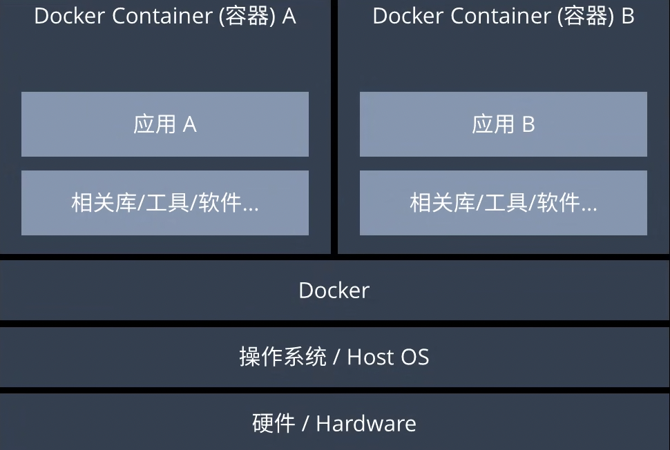
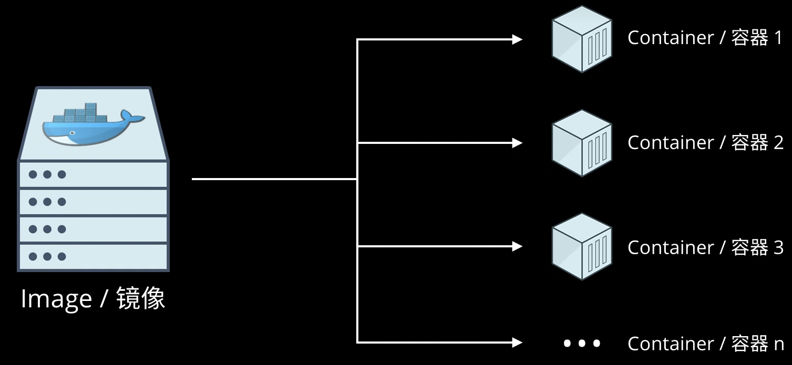
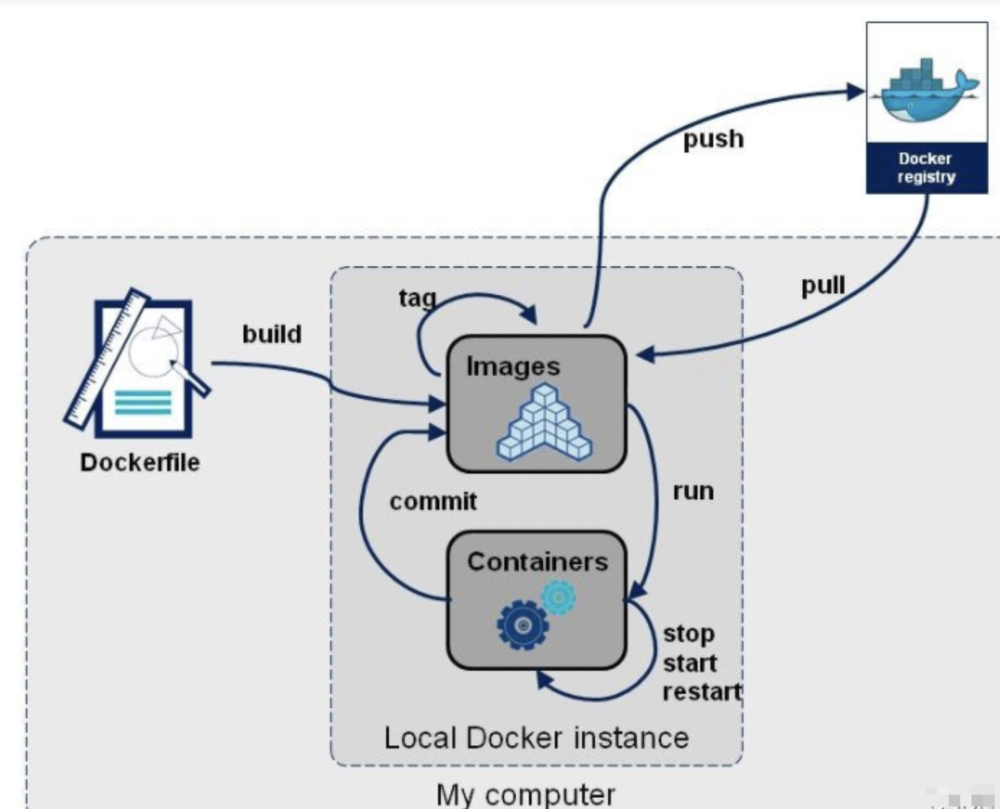

# Docker简介
    Docker 是一个开源的容器化平台，用于开发、部署和运行应用程序。
    它通过将应用程序及其依赖项打包到一个轻量级、可移植的容器中，实现跨环境的一致性运行（如开发、测试、生产环境）。

    Docker解决了标准化软件交付和运行环境一致性的问题。“快递打包标准化”
    Git解决了代码分布式版本控制（协同开发）的问题。“多人协作写文档”

## 背景知识

### 出现原因————软件部署和环境一致性
传统部署的痛点：
1. 环境不一致：开发、测试、生产环境差异导致“在我机器上能跑”问题。
2. 依赖冲突：不同应用依赖不同版本的库。
3. 资源浪费：虚拟机（VM）需要完整的操作系统，占用大量资源。
4. 部署复杂：手动配置服务器，容易出错。

### 解决方案————容器化
Docker 把软件 + 依赖 + 配置 打包成一个标准集装箱（镜像），无论运到哪（开发机、云服务器、本地电脑），打开就能直接运行，环境完全一致。
特点：
1. 轻量级：容器共享宿主机内核，无需完整 OS，启动快（秒级 vs 分钟级）。
2. 一致性：镜像打包所有依赖，确保“一次构建，到处运行”。
3. 隔离性：每个容器有独立文件系统、网络、进程空间（借助 Linux 的 cgroups 和 namespaces）。
4. 可移植性：镜像可在任何支持 Docker 的环境中运行（云、物理机、本地）。

### 相关问题
1. 虚拟机解决的问题：硬件资源抽象化和操作系统隔离。
虚拟机（VM）的本质是通过 虚拟化硬件（CPU、内存、磁盘等），在一台物理机上运行多个独立的操作系统实例。
通过 Hypervisor（虚拟化技术）（如 VMware ESXi、KVM）将物理机划分为多个虚拟机，每个 VM 运行不同应用。
Hypervisor作为中间层，为每个操作系统提供一个虚拟的硬件环境，使得这些操作系统之间相互隔离，互不干扰。
    作用：
    1. 不同应用之间环境强隔离（安全性/稳定性提升），避免相互干扰，独立性强。
    2. 提高硬件利用率。
    3. 环境一致性，可在一台物理机上同时运行 不同操作系统。

VM 的隔离单位是 完整的操作系统，而不是单个应用。
每个单独的操作系统内部的应用隔离：依赖操作系统自身的机制

假设：
Windows 上 5 个应用、macOS 上 4 个、Linux 上 8 个。

虚拟机方案：
3 个 VM（Windows VM、macOS VM、Linux VM），每个 VM 运行对应的 OS。

应用隔离方式：
Windows 的 5 个应用 → 运行在 Windows VM 内，由 Windows 系统管理。
macOS 的 4 个应用 → 运行在 macOS VM 内，由 macOS 系统管理。
Linux 的 8 个应用 → 运行在 Linux VM 内，由 Linux 系统管理。

2. 编程虚拟环境
项目级依赖隔离，隔离不同项目的依赖库，避免依赖库版本冲突。

隔离粒度和级别不一样
容器与虚拟机不同，它直接共享宿主机的操作系统内核，因此更轻量、启动更快、资源占用更少。

维度	虚拟机（VM）	Docker	编程虚拟环境
隔离级别	硬件级（完整 OS）	进程级（共享内核）	依赖级（仅库隔离）
启动速度	慢（分钟级）	快（秒级）	即时
资源占用	高（每个 VM 需独立 OS）	低（共享内核）	极低（仅文件隔离）
核心问题	硬件复用、强隔离	环境一致性、轻量部署	依赖版本冲突
典型工具	VMware、VirtualBox、KVM	Docker Engine、Podman	Python venv、conda、npm

场景	虚拟机（VM）	Docker
隔离单位	整个操作系统（OS）	单个应用（容器）
隔离强度	强（硬件级隔离）	中（共享内核，但进程隔离）
运行多个应用	每个 VM 内可运行多个应用（由 OS 管理）	每个容器通常只运行 1 个主进程
资源占用	高（每个 VM 需完整 OS）	低（共享宿主机内核）
适用场景	需要不同 OS 或强安全隔离	快速部署、微服务架构

## 核心概念
1. 镜像（Image）
    只读模板，包含运行应用程序所需的代码、库、环境等（如 Ubuntu + Nginx + Python 应用）。
    类似“安装包”，可以通过 Dockerfile 构建。
2. 容器（Container）
    镜像的运行实例，是一个隔离的进程，拥有独立的文件系统、网络和资源。
    类似“安装好的软件”，可以启动、停止、删除。
3. Dockerfile
    文本文件，定义如何构建镜像（例如从基础镜像开始，逐步添加配置和代码）。
4. Docker Hub
    官方的公共镜像仓库，存储大量预构建的镜像（如 MySQL、Redis 等），类似 GitHub 但存放的是镜像。

## 原理
直接共享宿主机的 Linux 内核，不虚拟化硬件。
在 Linux 系统上：容器原生运行，性能无损。
在非 Linux 系统（如 Windows/macOS）上：需通过轻量级 Linux 虚拟机（如 Hyper-V、WSL2）间接运行。

不同系统
Docker 的隔离技术（如 namespaces 和 cgroups、进程隔离、网络隔离、文件系统隔离）直接依赖 Linux 内核，因此在非 Linux 系统（如 Windows 或 macOS）上运行时，必须通过一个轻量级 Linux 虚拟机（VM）来提供 Linux 内核环境。

Docker 的四大核心原理：
1. 镜像分层与联合文件系统
    每个 Docker 镜像由多个 只读层（Layer） 组成，每一层代表一次修改（如安装软件、添加文件）。
    联合文件系统（UnionFS）：
    将多个只读层合并为一个统一的文件系统视图（如 overlay2、aufs）。
    写时复制（Copy-on-Write, CoW）：
    容器运行时，在镜像层之上添加一个 可写层，修改文件时复制到可写层，不影响镜像层。
2. 容器运行时（Container Runtime）
    管理每个容器的生命周期
3. 网络模型（Network Stack）
    让容器之间、容器与宿主机、容器与外部网络通信
4. 存储卷（Volume）

这种设计让 Docker 轻量、快速、适合云原生部署，但隔离性弱于虚拟机。

## Docker工作流程

1. 用户输入命令（如 docker run -p 8080:80 nginx）。
2. Docker 引擎解析镜像：
    检查本地是否有 nginx 镜像，若无则从 Docker Hub 拉取。
3. 创建容器：
    runc 调用 namespaces 和 cgroups 创建隔离环境。
4. 设置网络：
    分配虚拟网卡，配置 iptables 规则（端口映射）。
5. 挂载文件系统：
    使用 overlay2 加载镜像层，并添加可写层。
6. 启动进程：
    运行容器内的主进程（如 nginx）。

+-------------------------------------------------------------------------------------+
|                                                                                     |
|                               宿主机操作系统 (Host OS)                                |
|                                                                                     |
+-------------------------------------------------------------------------------------+
|                                                                                     |
|  +---------------------+    +---------------------+    +---------------------+      |
|  |      Linux 主机      |    |     Windows 主机     |    |      macOS 主机      |      |
|  |  (原生支持 Docker)   |    | (需 Linux 内核支持)  |    | (需 Linux 内核支持)  |      |
|  +----------+----------+    +----------+----------+    +----------+----------+      |
|             |                          |                          |                 |
|             | (直接共享内核)            | (通过轻量级 VM)           | (通过轻量级 VM)    |
|             |                          |                          |                 |
|  +----------v----------+    +----------v----------+    +----------v----------+      |
|  |   Docker 容器        |    |   Linux 虚拟机       |    |   Linux 虚拟机       |      |
|  |   (直接运行)         |    |  (WSL2/Hyper-V)     |     |  |(HyperKit)        |      |
|  |                     |    |                     |    |                     |      |
|  | +-----------------+ |    | +-----------------+ |    | +-----------------+ |      |
|  | |  容器进程       <-----+ | |  容器进程       <-----+ | |  容器进程       | |      |
|  | | (隔离环境)      | |    | | (隔离环境)      | |    | | (隔离环境)      | |      |
|  | +-----------------+ |    | +-----------------+ |    | +-----------------+ |      |
|  +---------------------+    +---------------------+    +---------------------+      |
|                                                                                     |
+-------------------------------------------------------------------------------------+

## Docker 引擎

Docker 引擎（Docker Engine） 是 Docker 技术的核心组件，扮演着“容器化操作系统”的角色，负责 创建、运行和管理容器。
作用：
1. 容器生命周期管理
2. 镜像构建与分发
3. 资源隔离与限制
4. 提供 API 和命令行接口

+-----------------------+
|     Docker CLI        | ← 用户输入命令（如 docker run）
+-----------------------+
           ↓
+-----------------------+
|   Docker Daemon       | ← 后台守护进程（管理容器/镜像）
|  (dockerd)            |
+-----------------------+
           ↓
+-----------------------+
|   containerd          | ← 容器运行时（生命周期管理）
+-----------------------+
           ↓
+-----------------------+
|   runc                | ← 底层工具（创建容器进程）
+-----------------------+

## Docker操作

docker images  #查看所有本地主机的镜像
docker search 镜像名           #搜索镜像
docker pull 镜像名 [标签]      #下载镜像（如果不写tag，默认是latest）
docker rmi  镜像名 [标签]       #删除镜像    docker rmi -f $(docker images -aq)  删除全部镜像
docker tag  镜像名:版本   新镜像名:版本    #复制镜像并且修改名称
docker commit  -a "xxx"  -c "xxx" 镜像ID 名字：版本   #提交镜像 
docker commit -m="提交的描述信息"  -a="作者"  容器id  目标镜像名:[TAG]
docker ps 默认只显示 正在运行（Up状态） 的容器。
docker ps -a 会显示 所有容器（包括已停止的容器）。

-a :提交的镜像作者；
-c :使用Dockerfile指令来创建镜像；
-m :提交时的说明文字；

docker load -i    /xxx/xxx.tar         #导入镜像
docker save -o   /xxx/xxx.tar          #保存一个镜像为一个tar包

打包镜像：
docker build -f mydockerfile -t image:1.0

推送镜像至docker hub。
docker tag  image/1.0 自己的账号名字/mytomcat 
docker push 自己的账号名字/mytomcat 
docker logs 容器#查看日志，报错信息 

## 实战
1. 从 Docker Hub 下载 MySQL 镜像
docker search mysql
docker pull mysql
docker image

2. 运行 MySQL 容器

docker run -d -p 80:80 --name mysql01 -e MYSQL_ROOT_PASSWORD=123456 mysql
docker ps
curl 127.0.0.1:80
curl localhost:80

3. 进入容器并操作 MySQL 
docker exec -it mysql01 mysql  -uroot -p123456
    在 MySQL 中创建测试数据库和表
    CREATE DATABASE testdb;
    USE testdb;
    CREATE TABLE users (id INT AUTO_INCREMENT, name VARCHAR(255), PRIMARY KEY (id));
    INSERT INTO users (name) VALUES ('Alice'), ('Bob');
    SELECT * FROM users;
    EXIT;

4. 创建自定义镜像（基于修改后的 MySQL）
    创建 Dockerfile
    cat > Dockerfile <<EOF
    FROM mysql

    添加注释和自定义配置
    LABEL maintainer="your-email@example.com"
    LABEL description="MySQL  with testdb pre-configured"

    复制初始化脚本（可选）
    COPY init.sql /docker-entrypoint-initdb.d/  # 容器启动时会自动执行

    保留原始启动命令
    CMD ["mysqld"]
    EOF

创建初始化脚本（示例）
echo "CREATE DATABASE IF NOT EXISTS my_custom_db;" > init.sql

构建自定义镜像
docker build -t my-custom-mysql .

5. 测试自定义镜像
docker tag my-custom-mysql your-username/my-mysql:1.0
运行自定义镜像
docker run -d --name custom-mysql -p 3307:3306 -e MYSQL_ROOT_PASSWORD=123456 my-custom-mysql

验证初始化是否生效
docker exec -it custom-mysql mysql -uroot -p123456 -e "SHOW DATABASES;"

6. 发布到 Docker Hub
docker login -u your-dockerhub-username
docker tag my-custom-mysql your-dockerhub-username/my-mysql:1.0
docker push your-dockerhub-username/my-mysql:1.0

# Dockerfile简介
    是一个创建镜像所有命令的文本文件，包含了一条条指令和说明, 每条指令构建一层,通过docker build命令，根据Dockerfile的内容构建镜像，因此每一条指令的内容, 就是描述该层如何构建。有了Dockefile,，就可以制定自己的docker镜像规则,只需要在Dockerfile上添加或者修改指令,就可生成docker 镜像。
